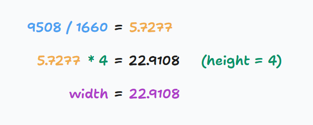
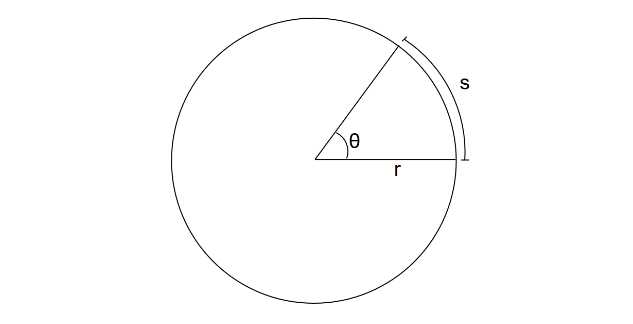
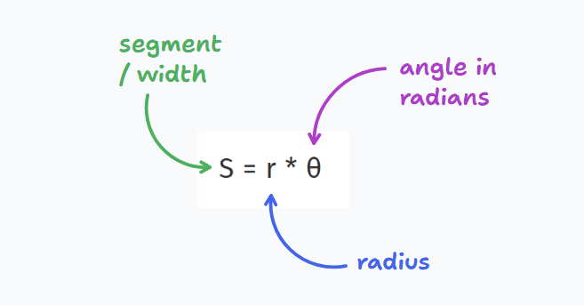
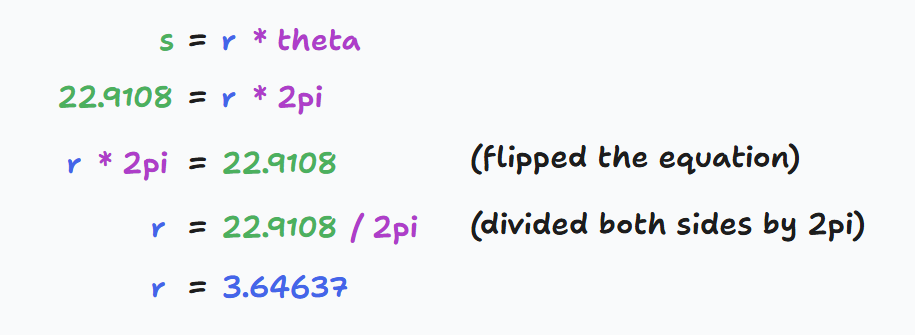
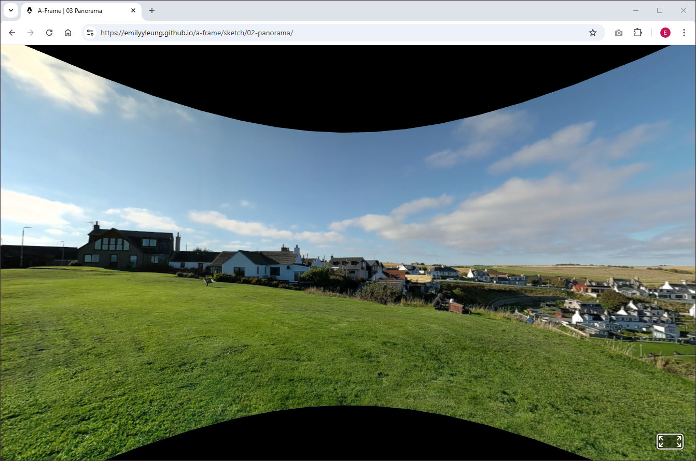

So it turns out that yesterday I had miscalculated the circumference of the curved image! 😅

Instead of dividing both height and width by 4, I needed to figure out the ratio between the two values...

In the image below, you can see that I'm using an image of dimensions 9508 x 1660. I'm looking to have the height set at 4.


Next I decide the height of the curved image (which in this case is 4). From there I can use it to multiply it against the height to get the resulting width.



Final bit of maths I needed to do was to fill in all the properties in curved image as mentioned in [their docs](https://aframe.io/docs/1.6.0/primitives/a-curvedimage.html#fine-tuning)



From the diagram above, the following formula is deducted



All I needed to do was figure out the radius



Then fill in the values where `theta-length` is in degrees

```html
<a-curvedimage
  src="#panorama"
  height="4.0"
  radius="3.64637"
  theta-length="360"
></a-curvedimage>
```

Then for final touch ups, I made sure to position the user to the centre of the curved image and limit the user to only be able to look around.

Because of the way panoramas work, the experience I built is less impressive when you can see the top and bottom edge.

> It is a better experience when you rotate your phone horizontally to align with the image



So I spent a bit of time researching how to improve the experience of viewing panoramas. Here are a couple of ideas I picked up from [this video](https://www.youtube.com/watch?v=L4nvvuAYGjA):

- If possible, set the camera to use 0.5 zoom to capture more of the above and below
- Capture 5 minutes worth of sound to embed into the experience (if it's windy, block the wind with your hands)

Best viewed horizontally, you can find project 1 here: [Panorama](/a-frame/sketch/1-panorama)

<video controls>
  <source src="/a-frame/ref/1-panorama.mp4" type="video/mp4">
</video>
