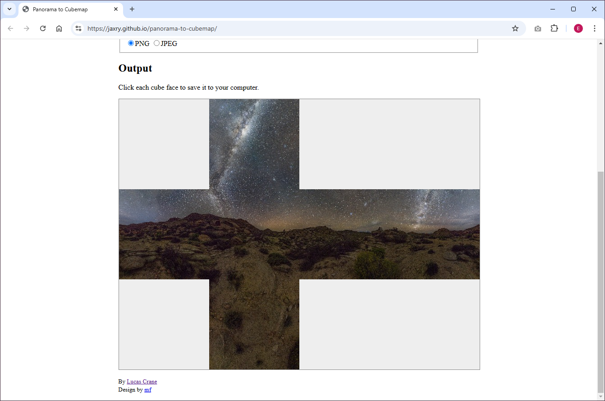

Since having found out yesterday that my phone (Pixel 4a) has the photosphere option built into the camera, I thought I'd give that a try.

The experience of taking a photosphere was interesting because you're effectively taking multiple shots of the same location but at different angles. The accuracy of the final output is difficult to get right when you're relying on your own hands to manouvre the camera is the correct angle. I think some form of AI was used to process the image, but it still doesn't produce a picture perfect result.

After some research, there are alternative solutions to use in order to create 360 images:

- 360 cameras like the "Insta360 X" series cameras
- Stabilizing arm such as the "Insta360 Flow"
- Built-in photosphere camera (some phones have this feature)

So today, after attempting to capture a 360 photo of my balcony (which I didn't end up publishing) - I worked on the second project in the series: [03 Skybox](/a-frame/sketch/03-skybox)

In the final project, I used this equirectangular [photo by Greg Zaal](https://polyhaven.com/a/rogland_clear_night) on Poly Haven.


To use this image, we need to load it in via the asset manager

```html
<a-assets>
  
</a-assets>
```

We can then apply the image as a material to the sky primitive.

> Note: The sky primitive only accepts equirectangular images

```html
<a-sky src="#photosphere"></a-sky>
```

An alternative to using an equirectangular image and a sky primitive is to create a cube and applying a cubemap version of the 360 image.

I found a [Panorama to Cubemap applet](https://jaxry.github.io/panorama-to-cubemap/) that does exactly that.



Also something to note is that iPhones and Safari users will likely need to allow permission for using the orientation of the device. So make sure to use the [device-orientation-permission-ui](https://aframe.io/docs/1.6.0/components/device-orientation-permission-ui.html). Note: I have yet to test whether this works

You can find project 3 here: [03 Skybox](/a-frame/sketch/04-interaction)
