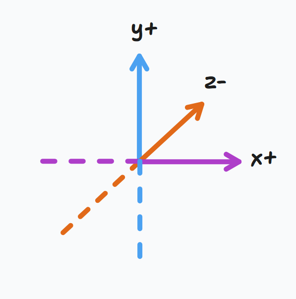

Hey friends,

At this point I'm pretty happy with the layout and styling of the website. Some of the changes include a navigation menu up the top of the home page as well as a <a href="/a-frame/blog">blog</a> route which lists all the entries I'll be making in the future.

My plan from here is to begin taking notes and creating sketches to understand how A-Frame works.

---

# Notes

Currently going through a tutorial series by [Sonar Systems](https://www.youtube.com/@SonarSystemsCoUk)

> Source: https://www.youtube.com/watch?v=dv6_C4UqTfs&list=PLRtjMdoYXLf4inSULAHyCMqpIUj4cmBTr

A-Frame is a virtual reality framework for the web.

We need to first reference the A-Frame package by loading it in the head of the HTML via a script tag. Then, we can create a scene element `<a-scene>` which will define the canvas in the HTML.

```html
<html>
  <head>
    <script src="https://aframe.io/releases/1.6.0/aframe.min.js"></script>
  </head>
  <body>
    <a-scene></a-scene>
  </body>
</html>
```

Everything inside of our scene will be specified inside of the `<a-scene>` tags

## Primitives

Primitives are `<a-entity>` elements that have predefined values.

```html
<a-box color="red" width="3"></a-box>

<!-- Is the same as -->

<a-entity geometry="primitive: box; width: 3" material="color: red"></a-entity>
```

## Transformations

There are 3 ways we can transform an entity:

- position
- rotation
- scaling

Position uses the X, Y, Z coordinate system. However, the directions are flipped around:

- X points right
- Y points up
- Z points forward

For some reason the directions aren't what I thought they would be



<iframe src="/a-frame/sketch/02-primitives" title="W3Schools Free Online Web Tutorials" className="w-full aspect-video"></iframe>

---

## Done List

- [x] Install TailwindCSS/Typography plugin for prose styling on blog entries
  - https://docs.astro.build/en/recipes/tailwind-rendered-markdown/
- [x] Create /posts page to list all posts

## Call to Action

- [ ] Go through the A-Frame tutorials / documentation
